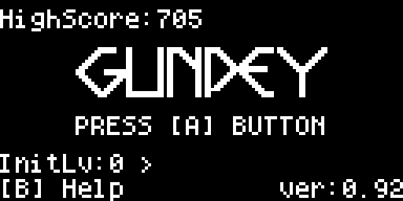
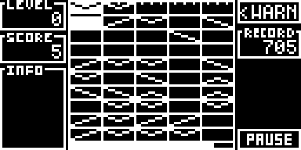

# Ardupey

A gunpey clone for Arduboy.

The code is mainly written by [chokmah.jp](https://community.arduboy.com/u/chokmah.jp), He released this game here [Gunpy - ( GUNPEY clone )](https://community.arduboy.com/t/gunpy-gunpey-clone/11251)

Here are some changes I have made

* Fixed the following errors:
  * Theoretically there are 4 different lines, but only 3 of them (\ / V) appeared in the previous version, and now the last one (Λ) has been added.
  * Lines would not be erased correctly in some cases (There may still be some undetected cases)
  * When the pause button is in focus, and the game is restarted after game over, the position of initial selected area becomes incorrect.

* Redrawn the title and game interface

  
  
  

I like gunpey very much, and I am very grateful to chokmah.jp for recreating it on arduboy for us
